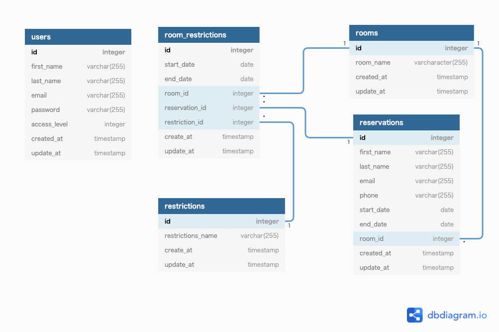

# go-bookings
Go言語でWebアプリケーションを作成する

## 使用しているライブラリー
### GOライブラリー
- Built in Go version 1.17
- Uses the [chi router](github.com/go-chi/chi)
- Uses [alex edwards scs session management](github.com/alexedwards/scs)
- Uses [nosurf](github.com/justinas/nosurf)
- Uses [govalidator](github.com/asaskevich/govalidator)

### CSS Framework
- Uses [bootstrap](https://getbootstrap.com/) V5.1

### Javascript Framework
- Uses [vanillajs-datepicker](https://github.com/mymth/vanillajs-datepicker)
- Uses [notie](https://github.com/jaredreich/notie)
- Uses [sweetalert](https://github.com/sweetalert2/sweetalert2)

## データベース設計
